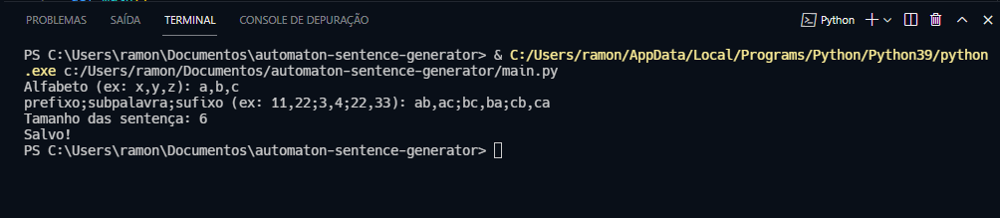

# Automaton Sentence Generator
## Gerador de sentenças para autômato
----

Este software gera um conjunto de sentenças de tamanho *n* a partir de um conjunto de símbolos.

Além disso, dados um conjunto de prefixo, subcadeias e sufixo o software gera dois arquivos *.txt* com as sentenças que devem ser aceita e as que devem ser rejeitadas.

 

## Como usar

 

1. Entrada do alfabeto, separando os símbolos por vírgula (sem espaço). ex: *a,b,c*
2. Entrada do prefixo, subcadeia e sufixo, separando-os por *;* entre sí (sem espaço). Em cada conjunto, internamente, seus tokens devem ser separados por vírgula.
3. Entrada do tamanho das sentenças geradas. 

*Exemplo de uma entrada que irá gerar um conjunto de sentenças com os símbolos a, b, c com o tamanho 6. E as sentenças válidas precisam ter os prefixo ab ou ac; subcadeia bc ou ba; e sufixo cb ou ca.*

